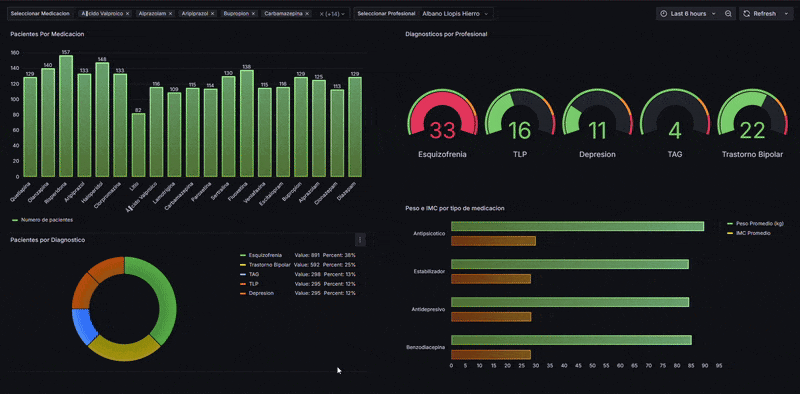

🏥 Health Data Dashboard 📊

Este proyecto te permite simular la gestión y visualización de datos de pacientes atendidos en un consultorio externo. A través de una combinación de generación de datos ficticios, bases de datos relacionales y herramientas de visualización de datos, podrás explorar métricas interesantes y obtener información valiosa sobre la atención médica.

✨ Funcionalidades Destacadas
Este proyecto aborda las siguientes funcionalidades clave:

- Generación de Datos Ficticios:

Crea 6 archivos CSV (.csv) con datos aleatorios y ficticios de pacientes, abarcando información como datos demográficos, diagnósticos, medicaciones y médicos tratantes.

- Base de Datos MySQL con Docker:

Configura y levanta una base de datos MySQL en un contenedor Docker.
Alimenta la base de datos con los datos generados en los archivos CSV.
Diseña una estructura de base de datos relacional con tablas conectadas mediante claves primarias (PK) y claves foráneas (FK) para asegurar la integridad y coherencia de los datos.

- Visualización con Grafana y Docker:

Levanta una instancia de Grafana en un contenedor Docker.

Conecta la instancia de Grafana con la base de datos MySQL.

Diseña un dashboard interactivo en la interfaz web de Grafana para mostrar métricas interesantes de los datos, como:
Cantidad de pacientes que toman una medicación específica.
Número de pacientes con cada diagnóstico atendido por cada profesional.
Y otras visualizaciones personalizables.


🚀 Cómo Empezar
Para poner en marcha este proyecto, sigue los siguientes pasos:

Prerrequisitos
Asegúrate de tener instalados los siguientes componentes en tu sistema:

Docker: Instalar Docker

Docker Compose: Instalar Docker Compose

Python 3.13.3: Instalar Python

Git: Instalar Git

Clona este repositorio en tu máquina local:
```
Bash

git clone https://github.com/brezsosa/Medical_db.git

cd Medical_db
```
Configuración del Entorno
Instalar dependencias de Python:

Se recomienda crear un entorno virtual para instalar las dependencias
```
Bash

pip install -r requirements.txt
```
Ejecutar el proyecto:

El archivo app.py se encarga de orquestar la generación de datos, la configuración de la base de datos y el levantamiento de los servicios Docker.
```
Bash

python app.py
```
Este comando realizará las siguientes acciones:

- Ejecutará crea_csv.py para generar los archivos CSV.
- Ejecutará docker-compose up -d para levantar los contenedores de MySQL y Grafana.
- Ejecutará crea_db.py para configurar la base de datos MySQL y cargar los datos desde los CSV.
- Finalmente, la instancia de Grafana estará disponible.

Acceder al Dashboard de Grafana:

Una vez que todos los servicios estén en funcionamiento, podrás acceder a la interfaz web de Grafana.

Abre tu navegador y navega a: http://localhost:3000 (el puerto predeterminado de Grafana).

Las credenciales por defecto son:
Usuario: admin
Contraseña: admin (se te pedirá cambiarla en el primer inicio de sesión)

Dentro de Grafana, deberias conectar la fuente de datos para empezar a diseñar un dashboard a medida.


📂 Estructura del Proyecto

El proyecto está organizado de la siguiente manera:
```
.
├── src/
│   ├── app.py                     # Orquestador principal del proyecto
│   ├── crea_csv.py                # Script para generar archivos CSV con datos ficticios
│   ├── crea_db.py                 # Script para crear y configurar la base de datos MySQL
│   └── init.sql                   # Script SQL para la inicialización de la base de datos
├── data/
│   └── (archivos_csv_generados)/  # Contiene los 6 archivos CSV con datos ficticios
├── docker-compose.yml             # Archivo de configuración para Docker Compose (MySQL y Grafana)
├── requirements.txt               # Dependencias de Python para el proyecto
├── README.md                      # Este archivo README
└── dashboard_preview.gif          # Vista previa del dashboard de Grafana
```
🖼️ Vista Previa del Dashboard

Aquí tienes una pequeña muestra del tipo de visualizaciones que podrás diseñar en el dashboard de Grafana:





🤝 Contribuciones

¡Las contribuciones son bienvenidas! Si tienes alguna idea para mejorar este proyecto, no dudes en abrir un issue o enviar un pull request.


### Autor Braian E. Sosa
